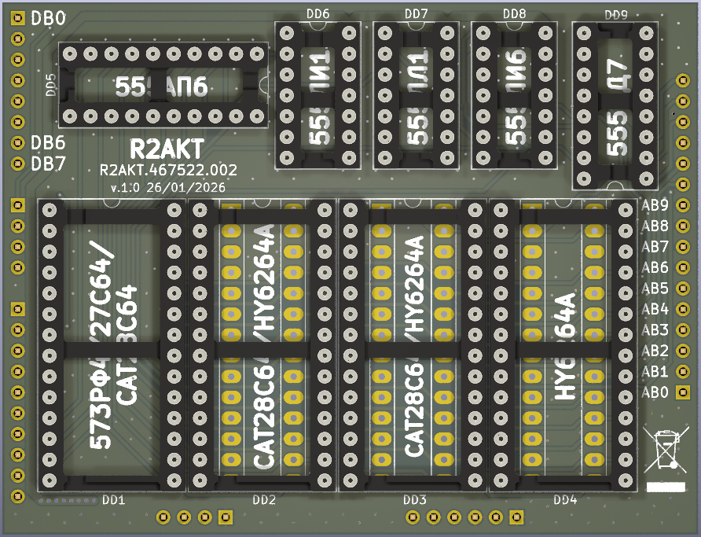

License addendum - https://github.com/R2AKT/flat_mem_32k/blob/main/Addendum.txt
# flat_mem_32k

32k flat (linear) memory board: 8k ROM + 8k EEPROM/RAM + 8k EEPROM/RAM + 8k RAM.
For Mega-80 (Mega-580) DIY 8-bit micro-computer - https://github.com/R2AKT/Mega-80.

ROM - 8k;
PROM - 8/16k;
RAM - 16/8k.

Status: not tested!

Плата плоской (линейной) памяти на 8к.
Для подключения к процессорной плате CPU_8080 - https://github.com/R2AKT/CPU_8080.

ПЗУ - 8кб;
ППЗУ - 8/16кб;
ОЗУ - 16/8кб.

Статус: не проверено!
